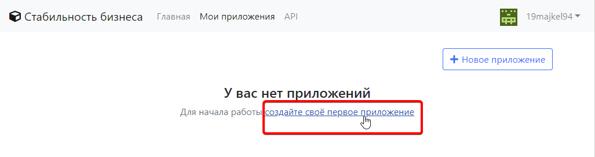

# Создание клиента OAuth

Для начала работы с API необходимо создать клиента OAuth, чтобы могли идентифицировать приложение, делающее запросы на нашем сервисе.

## Создание приложения в личном кабинете

Перейдите по ссылке [https://api.busstab.ru/clients](https://api.busstab.ru/clients+)  
Если Вы ещё не авторизованы, Вам потребуется войти на сайт используя свой логин и пароль \(в случае отсутствия такового, необходимо зарегистрироваться\).

После этого, в разделе "Мои приложения" нажмите на ссылку "Создать приложение":

Затем заполните поле **Название приложения** и нажмите **Создать**:

После успешного создания клиента, Вы увидите **ID клиента** и **Секрет клиента**, запомним их

Так же, нам необходимо выбрать разрешённые grant types для нашего приложения. Их выбор основывается на предпочитаемом методе аутентификации и архитектуре приложения \(клиентская/серверная/клиент-серверная\). Об этом подробнее в следующем разделе - [аутентификации](authorization.md).

